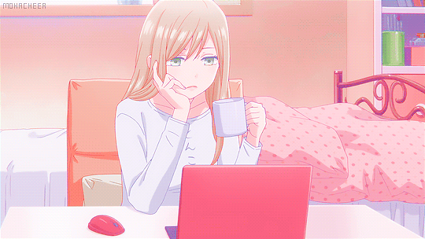

<h2> Olá! 🎀 Bruna Quignoli </h2>

 <h4 align = "center"> 👩🏼‍💻 Estudante de engenharia de software aprendendo a programar e fazer documentação técnica. Embora ainda não tenha experiência profissional formal, desenvolvo projetos acadêmicos e pessoais que me permitem aplicar e aprimorar minhas habilidades e conhecimentos na área. </h4>

 <h5 align = "center" > 🖥️ Hi! I'm Bruna, a Brazilian Software Engineering student who is learning how to program and create technical documentation. I don't have any professional experience yet, but I'm working on some academic and personal projects that allow me to apply and improve my skills and knowledge in the field! </h5>

#

<section align = "center"> 
  <h5> Algumas formas de me contactar! / Some ways to contact me! </h5>
 
 
  

  
  <h5> Linguagens e tecnologias que eu estou estudando ou me aprofundando: </h5>
  
  
      
      
      
      
      
      
</section>

<!--
**brunaquignoli/brunaquignoli** is a ✨ _special_ ✨ repository because its `README.md` (this file) appears on your GitHub profile.

Here are some ideas to get you started:

- 🔭 I’m currently working on ...
- 🌱 I’m currently learning ...
- 👯 I’m looking to collaborate on ...
- 🤔 I’m looking for help with ...
- 💬 Ask me about ...
- 📫 How to reach me: ...
- 😄 Pronouns: ...
- ⚡ Fun fact: ...
-->

#

   
  

  

